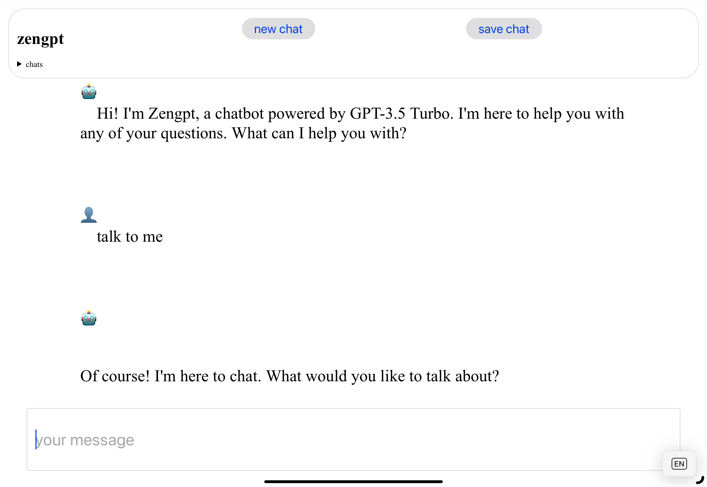

# zengpt

[accompanying blog post](https://cri.dev/posts/2023-10-17-zengpt-chapgpt-alternative-frontend-opensource-self-hosting/)

Stupid simple chat ui clone, using a bare node.js http, server-sent events, htmx and alpine

Set `OPENAI_API_KEY` env variable to your openai api key

Once you have the api key, you can run the server with `npm start`

Open a new browser tab and go to `http://localhost:3000`

## with docker

Provide the env var OPENAI_API_KEY either via `env_file` or by specifying it in the `docker-compose.yml` file.

Update the `docker-compose.yml` file accordingly.

Start zengpt on port 3000 with `docker-compose up -d`

You can specify the port with the `HTTP_PORT` env var.
