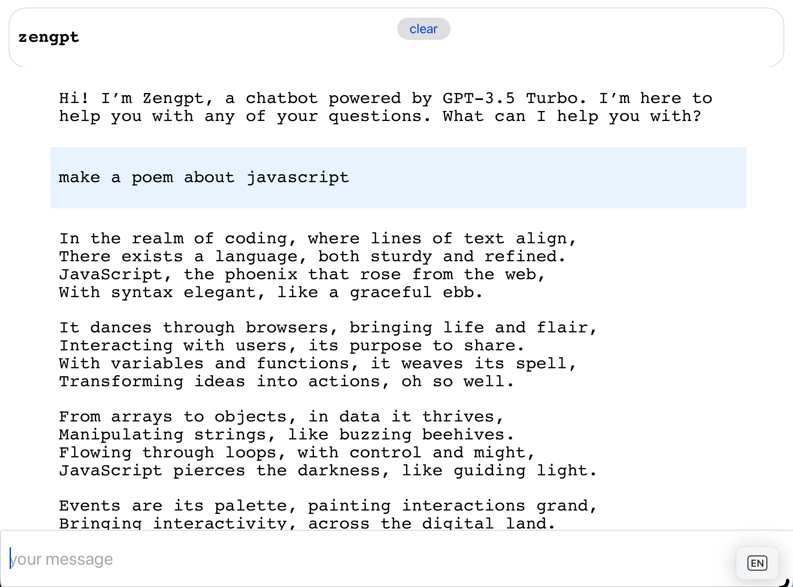

# zengpt

Stupid simple chat ui clone, using a bare node.js http, htmx and alpine

Set `OPENAI_API_KEY` env variable to your openai api key

Once you have the api key, you can run the server with `npm start`

Open a new browser tab and go to `http://localhost:3000`

